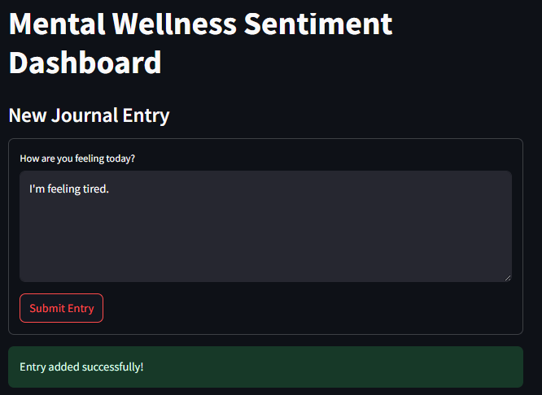

# Mental Wellness Sentiment Dashboard

This is a web-based journaling app that analyzes emotional sentiment from daily journal entries using Natural Language Processing. Built with **Streamlit**, the dashboard lets you write personal thoughts, auto-classifies the mood (like *Happy*, *Anxious*, *Calm*, etc.), and visualizes emotional trends using interactive charts.

---

## Key Features

- **Write Daily Journal Entries** – Express your thoughts in natural language.
- **Sentiment Analysis** – Uses TextBlob and VADER to analyze emotional tone.
- **Automatic Mood Detection** – Classifies each entry into moods based on sentiment scores.
- **Interactive Visualizations**:
  - **Line Chart** – Shows sentiment score trends by date.
  - **Pie Chart** – Summarizes overall mood distribution.
- **Data Storage** – Entries are saved to a local CSV file (`data/sample_data.csv`).

---

