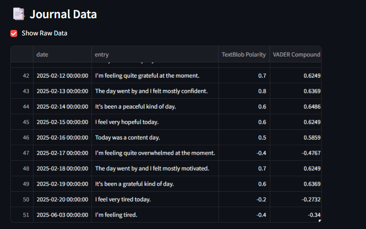
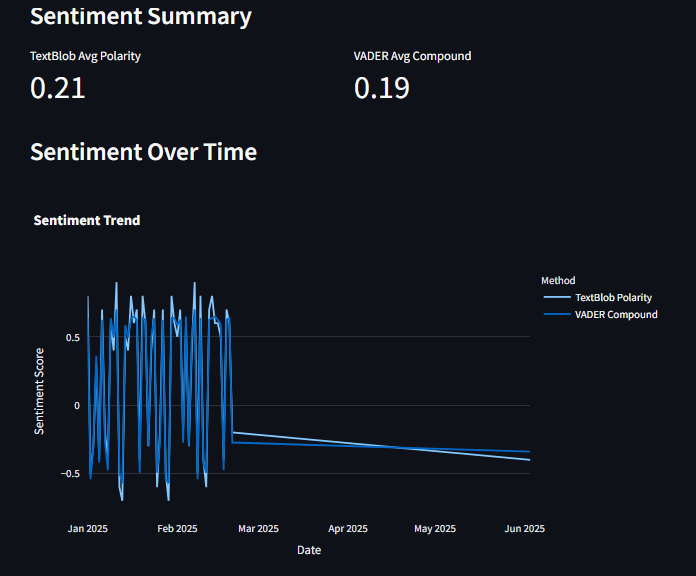
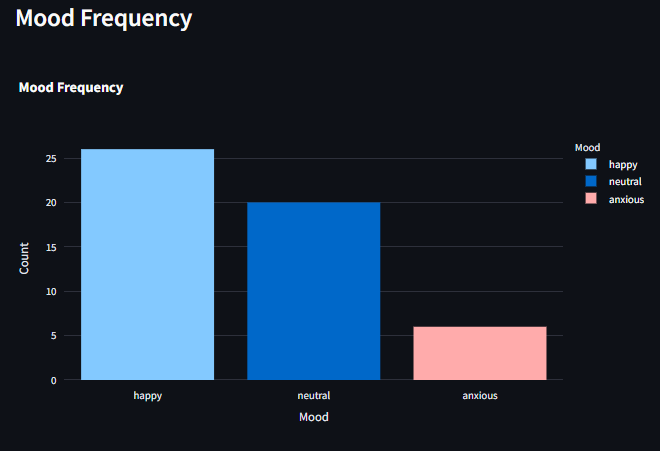
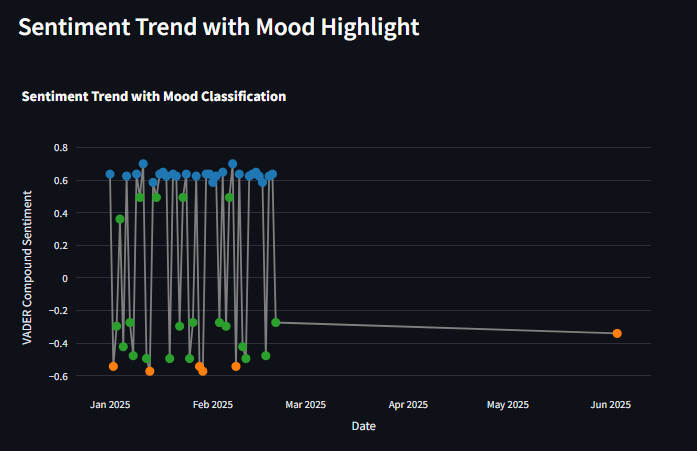
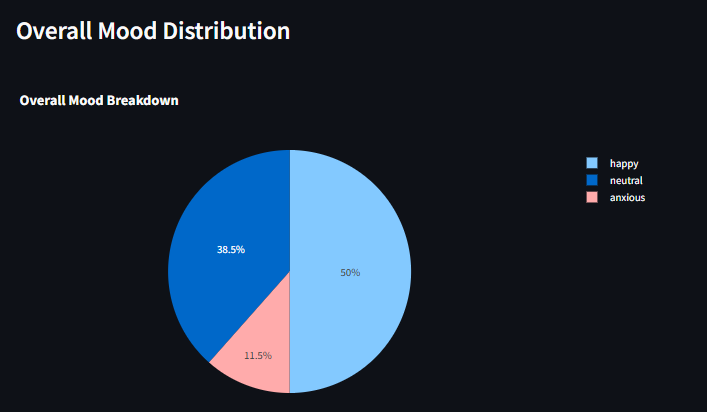

# **Mental Wellness Sentiment Dashboard**

This is a web-based journaling application that analyzes emotional sentiment from daily journal entries using Natural Language Processing (NLP). Built with **Streamlit**, the dashboard enables users to:

- Write personal thoughts in natural language.
- Automatically classify moods (e.g., *Happy*, *Anxious*, *Calm*).
- Visualize emotional trends using interactive charts.

---

## 🔑 **Key Features**

- **📝 Write Daily Journal Entries**  
  Capture your thoughts in free-form natural language.

- **🧠 Sentiment Analysis**  
  Utilizes **TextBlob** and **VADER** to detect emotional tone and polarity.

- **🎯 Automatic Mood Detection**  
  Automatically categorizes entries into moods based on sentiment scores.

- **📊 Interactive Visualizations**
  - **Line Chart:** Displays sentiment score trends over time.
  - **Pie Chart:** Summarizes the overall mood distribution.
  - **Bar Chart:** Shows mood frequency and comparison across entries.

- **💾 Data Storage**  
  All entries are saved locally in a CSV file (`data/sample_data.csv`) for future reference and analysis.

---

## 🖼️ **Screenshots**

> Below are screenshots of the dashboard in action:

### 🔹 Dashboard Overview  

### 🔹 Journal Entry Input  

### 🔹 Sentiment Analysis Result  

### 🔹 Mood Frequency Bar Chart  

### 🔹 Sentiment Trend Line Chart  

### 🔹 Mood Distribution Pie Chart  

---
